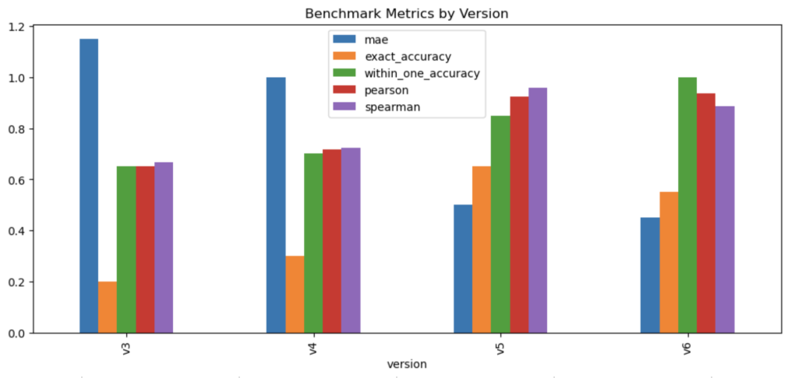

# Error Analysis

This document summarizes where the interview-answer scoring models fail, which inputs are most challenging, and why the later versions improve on earlier ones.

## Visualization

Figure 1 shows the benchmark comparison across model versions. The chart confirms that the LLM-based evaluators improve overall benchmark alignment relative to v3 and v4. It also shows the main tradeoff between the two LLM variants: v5 is stronger on exact-match style metrics, while v6 is stronger on overall calibration metrics such as MAE and within-plus-or-minus-one accuracy.

## Most Challenging Input Types

The benchmark results show that the hardest inputs are:

1. Topical but incorrect answers
   Example cases: 11, 12, 14
   These answers contain related technical words, which can make similarity-based models appear overly confident even when the core claim is wrong.

2. Question restatements and explicit non-answers
   Example cases: 15, 16, 17, 18, 20
   These responses look superficially related to the prompt but do not demonstrate actual knowledge.

3. Short partial answers
   Example cases: 7, 8, 9, 10
   These answers may be technically relevant but omit important details, making it difficult to distinguish between partial understanding and strong concise knowledge.

4. Concise but correct answers
   Example cases: 2, 5, 6
   These answers are accurate but shorter than the reference answer, which can cause some evaluators to under-score them for completeness.

## Failure Modes by Model Version

### v3 and v4: semantic similarity can over-score wrong but related answers

The hybrid embedding-based scorers are strongest on broad relevance matching, but they often over-score answers that contain the right topic words while missing or contradicting the key idea.

Examples:
- Case 11: `Kubernetes is a type of containerization.`
- Case 12: `A RESTful API is just any API that uses JSON.`
- Case 15: question restatement instead of an answer

Why this happens:
- sentence embeddings capture topical similarity well
- keyword overlap can reward related vocabulary
- neither signal fully verifies technical correctness

This explains why v3 and v4 performed worse on benchmark alignment than the LLM-based scorers.

### v5: better correctness checks, but sometimes too conservative

The v5 rubric-based LLM scorer greatly improves handling of incorrect or meaningless answers, but it occasionally under-scores concise strong answers.

Examples:
- Case 2: strong DOM answer scored lower than expected
- Case 5: strong conflict-resolution answer scored lower than expected
- Case 6: strong database-optimization answer scored lower than expected

Why this happens:
- the prompt asks for rubric-based completeness, which can cause short but correct answers to lose points
- the model can be conservative when an answer is accurate but less detailed than the reference answer

### v6: best overall calibration, but still vulnerable to over-rewarding clear partial answers

The v6 structured rubric model produced the best mean absolute error and perfect within-1 accuracy, but it still shows some over-scoring on partial answers that are clear and topically relevant.

Examples:
- Case 7: partial load-time optimization answer scored very highly
- Case 9: encapsulation answer without the requested example still scored highly
- Case 10: scalable notification-system answer received a stronger score than expected
- Case 18: explicit non-answer was still not always driven fully to the minimum score

Why this happens:
- v6 separates correctness, completeness, and clarity
- a response can receive a strong clarity signal even when it is incomplete
- deterministic subscore mapping improves consistency but can still elevate polished partial answers

## Final Model Context

Despite those remaining issues, v6 is the strongest overall model because it:

- achieved the lowest benchmark MAE
- achieved perfect accuracy within plus or minus one rating
- achieved the highest Pearson correlation
- handled topical-but-wrong and restated answers more reliably than v3 and v4
- provides interpretable correctness, completeness, and clarity subscores

At the same time, v5 remains slightly stronger on exact accuracy and Spearman correlation. The full decision rationale for selecting `v6` as the deployed model is documented separately in `docs/design_tradeoffs.md`.

In other words, the main remaining failure mode in v6 is moderate over-scoring of clear partial answers, which is a smaller problem than the severe correctness failures seen in the earlier versions.

## Evidence Sources

- Full case-level outcomes: `data/results/version_benchmark_results.csv`
- Metric summaries: `docs/benchmark_metrics_table.md`
- Quantitative notebook analysis: `notebooks/benchmark_analysis.ipynb`
